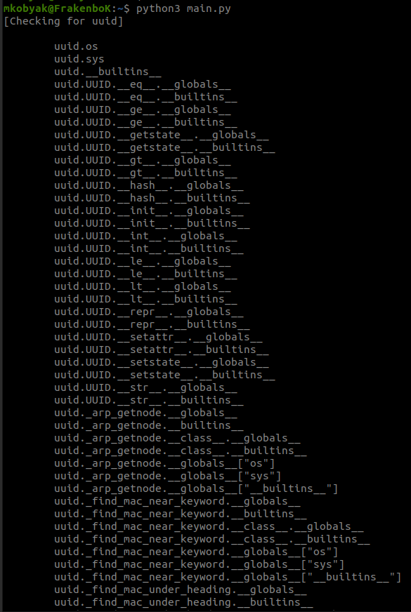

# python-sandbox-gadgets-finder

### Description

This is a script for gadgets searching while bypassing the limitations of python sandboxes. It recursively goes through all the dependencies of the package you specified to a certain depth in search of patterns useful for RCE, for example, the `os` module

### Example

Here is an example of using script with uuid module:

